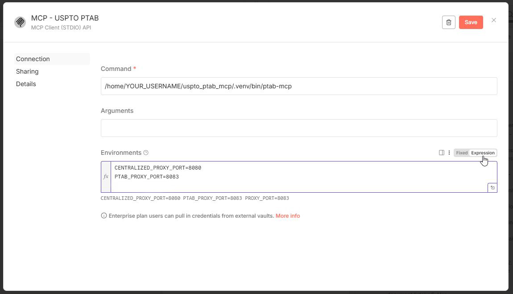
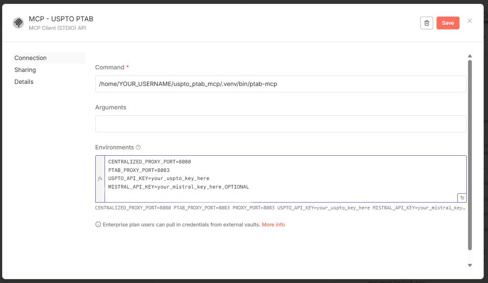
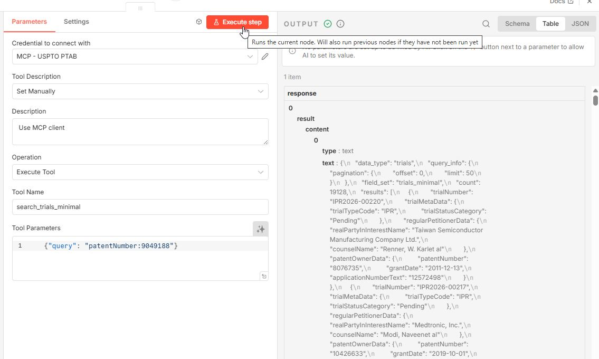

# Installation Guide - USPTO PTAB MCP

Complete installation and deployment guide for the USPTO PTAB MCP Server.

---

## 📢 Important: API Transition & Prerequisites

**This PTAB MCP Was Delayed**

This USPTO PTAB MCP release was delayed due to the USPTO's **Developer Hub API decommissioning its PTAB endpoints on January 6, 2026**. The MCP has been completely rebuilt to use the current **Open Data Portal (ODP) API**. See the [USPTO PTAB Transition Guide](https://data.uspto.gov/apis/transition-guide/ptab) for details.

**⚠️ IMPORTANT FOR ALL INSTALLATIONS**

Whether you're installing PTAB for the first time or updating existing USPTO MCPs:

- **It is recommended to Install (or update if installed, prior to 19 Jan. 2026) Patent File Wrapper ([PFW](https://github.com/john-walkoe/uspto_pfw_mcp)) MCP FIRST** before installing PTAB
- The updated PFW includes essential centralized proxy enhancements for PTAB document downloads
- Without updated PFW, PTAB will use standalone mode (less optimal, no persistent links)

**Already Have Other USPTO MCPs Installed Before Jan 19, 2026?**

See the complete **[MCP Update Guide](MCP_UPDATE_GUIDE.md)** for:
- Why updates matter (corrected PTAB tool references, centralized proxy support)
- Which MCPs to update (PFW = HIGH priority, FPD = Medium, Citations = Low)
- Step-by-step update instructions (Git and manual ZIP methods)

---

## Table of Contents

- [Prerequisites](#prerequisites)
- [Quick Installation (Automated)](#quick-installation-automated)
  - [Windows (PowerShell)](#windows-powershell)
  - [Linux/macOS (Bash)](#linuxmacos-bash)
- [Manual Installation](#manual-installation)
- [API Key Acquisition](#api-key-acquisition)
- [Claude Desktop Configuration](#claude-desktop-configuration)
- [Verification](#verification)
- [Security Considerations](#security-considerations)
- [Troubleshooting](#troubleshooting)

---

## Prerequisites

### Required

1. **Python 3.11+** (will be installed automatically by `uv`)
2. **uv** package manager (will be installed automatically by setup script)
3. **Git** (for cloning repository)
4. **Claude Desktop** or **Claude Code**

### API Keys Required

1. **USPTO API Key** (required) - Get from [https://data.uspto.gov/myodp/](https://data.uspto.gov/myodp/)
   - Format: 30 lowercase letters (a-z)
   - Example: `abcdefghijklmnopqrstuvwxyzabcd`
   - see [API_KEY_GUIDE.md](API_KEY_GUIDE.md)
2. **Mistral API Key** (optional - for OCR document extraction)
   - Format: 32 alphanumeric characters (mixed case)
   - Example: `abc123XYZ456def789GHI012jkl345MN`
   - Get from: [https://console.mistral.ai/](https://console.mistral.ai/)
   - Required only for `ptab_get_document_content()` tool
   - see [API_KEY_GUIDE.md](API_KEY_GUIDE.md)

---

## Quick Installation (Automated)

### Windows Install

**Run PowerShell as Administrator**, then:

```powershell
# Navigate to your user profile
cd $env:USERPROFILE

# If git is installed:
git clone https://github.com/john-walkoe/uspto_ptab_mcp.git
cd uspto_ptab_mcp

# If git is NOT installed:
# Download and extract the repository to C:\Users\YOUR_USERNAME\uspto_ptab_mcp
# Then navigate to the folder:
# cd C:\Users\YOUR_USERNAME\uspto_ptab_mcp

# The script detects if uv is installed and if it is not it will install uv - https://docs.astral.sh/uv

# Run setup script (sets execution policy for this session only):
Set-ExecutionPolicy -ExecutionPolicy Unrestricted -Scope Process
.\deploy\windows_setup.ps1

# View INSTALL.md for sample script output.
# Close Powershell Window.
# If choose option to "configure Claude Desktop integration" during the script then restart Claude Desktop
```

**What the script does:**
1. Checks for `uv` package manager (installs if missing)
2. Installs all project dependencies
3. Prompts for USPTO API key (with validation)
4. Prompts for Mistral API key (optional)
5. Stores API keys in secure storage (DPAPI encrypted)
6. Generates Claude Desktop configuration
7. Verifies installation

**Security Features (Windows)**:
- API keys encrypted using Windows DPAPI
- Keys stored in `~/.uspto_api_key` and `~/.mistral_api_key`
- Only current Windows user can decrypt keys
- API keys never stored in config files or environment variables

**Example Windows Output:**

```
PS C:\Users\YOUR_USERNAME\uspto_ptab_mcp> .\deploy\windows_setup.ps1
=== USPTO PTAB MCP - Windows Setup ===
[INFO] Python NOT required - uv will manage Python automatically

[INFO] uv not found. Installing uv...
Found uv [astral-sh.uv] Version 0.9.26
This application is licensed to you by its owner.
Microsoft is not responsible for, nor does it grant any licenses to, third-party packages.
This package requires the following dependencies:
  - Packages
      Microsoft.VCRedist.2015+.x64
Downloading https://github.com/astral-sh/uv/releases/download/0.9.26/uv-x86_64-pc-windows-msvc.zip
  ██████████████████████████████  20.9 MB / 20.9 MB
Successfully verified installer hash
Extracting archive...
Successfully extracted archive
Starting package install...
Command line alias added: "uvx"
Command line alias added: "uv"
Command line alias added: "uvw"
Successfully installed
[OK] uv installed via winget
[OK] uv is now accessible: uv 0.9.26 (ee4f00362 2026-01-15)
[INFO] Installing dependencies with uv...
[INFO] Creating virtual environment...
Using CPython 3.12.11
Creating virtual environment at: .venv
Activate with: .venv\Scripts\activate
[OK] Virtual environment created at .venv
[OK] pyvenv.cfg already exists (newer uv version)
[INFO] Installing dependencies with prebuilt wheels (Python 3.12)...
Resolved 73 packages in 2ms
Installed 72 packages in 2.28s
 + annotated-doc==0.0.4
 + annotated-types==0.7.0
...
 + websockets==16.0
 + zipp==3.23.0
[OK] Dependencies installed
[INFO] Verifying installation...
[WARN] Warning: Command verification failed - check PATH
[INFO] You can run the server with: uv run ptab-mcp

Unified API Key Configuration

[INFO] Checking for existing API keys in unified storage...
[INFO] Testing secure storage system...
[OK] Secure storage system working
[INFO] No API keys found in unified storage

API Key Format Requirements:
============================

USPTO API Key:
  - Required: YES
  - Length: Exactly 30 characters
  - Format: Lowercase letters only (a-z)
  - Example: abcdefghijklmnopqrstuvwxyzabcd
  - Get from: https://data.uspto.gov/myodp/

Mistral API Key:
  - Required: NO (optional, for OCR)
  - Length: Exactly 32 characters
  - Format: Letters (a-z, A-Z) and numbers (0-9)
  - Example: AbCdEfGh1234567890IjKlMnOp1234
  - Get from: https://console.mistral.ai/

Enter your USPTO API key: ****************************** [your_actual_USPTO_api_key_here]
[OK] USPTO API key format validated (30 chars, lowercase)
[INFO] Mistral API key is OPTIONAL (for OCR on scanned documents)
[INFO] Press Enter to skip, or enter your 32-character Mistral API key

Enter your Mistral API key (or press Enter to skip): ******************************** [your_mistral_api_key_here_OPTIONAL]
[OK] Mistral API key format validated (32 chars, alphanumeric)

[INFO] Storing API keys in unified secure storage...
[OK] USPTO API key stored in unified secure storage
     Location: ~/.uspto_api_key (DPAPI encrypted)
[OK] USPTO API key stored in unified storage
[OK] Mistral API key stored in unified secure storage
     Location: ~/.mistral_api_key (DPAPI encrypted)
[OK] Mistral API key stored in unified storage

[OK] Unified storage benefits:
     - Single-key-per-file architecture
     - DPAPI encryption (user + machine specific)
     - Shared across all USPTO MCPs (FPD/PFW/PTAB/Citations)
     - Files: ~/.uspto_api_key, ~/.mistral_api_key

[INFO] Configuring shared INTERNAL_AUTH_SECRET...
[OK] Using existing INTERNAL_AUTH_SECRET from unified storage
     Location: ~/.uspto_internal_auth_secret (DPAPI encrypted)
     Shared with other installed USPTO MCPs
     This secret authenticates internal MCP communication

Claude Desktop Configuration


Would you like to configure Claude Desktop integration? (Y/n): y

Claude Desktop Configuration Method:
  [1] Secure Python DPAPI (recommended) - API keys loaded from secure storage
  [2] Traditional - API keys stored in Claude Desktop config file

Enter choice (1 or 2, default is 1): 1
[OK] Using unified secure storage (no API keys in config file)
     API keys loaded automatically from ~/.uspto_api_key and ~/.mistral_api_key
     This configuration works with all USPTO MCPs sharing the same keys

[INFO] Claude Desktop config location: C:\Users\YOUR_USERNAME\AppData\Roaming\Claude\claude_desktop_config.json
[INFO] Existing Claude Desktop config found
[INFO] Merging USPTO PTAB MCP configuration with existing config...
[INFO] Backup created: C:\Users\YOUR_USERNAME\AppData\Roaming\Claude\claude_desktop_config.json.backup_20260118_003642
[OK] Successfully merged USPTO PTAB MCP configuration!
[OK] Your existing MCP servers have been preserved
[INFO] Configuration backup saved at: C:\Users\YOUR_USERNAME\AppData\Roaming\Claude\claude_desktop_config.json.backup_20260118_003642
[OK] Claude Desktop configuration complete!

Windows setup complete!
Please restart Claude Desktop to load the MCP server

Configuration Summary:
  [OK] USPTO API Key: Stored in unified secure storage
       Location: ~/.uspto_api_key (DPAPI encrypted)
  [OK] Mistral API Key: Stored in unified secure storage
       Location: ~/.mistral_api_key (DPAPI encrypted)
  [OK] Storage Architecture: Single-key-per-file (shared across USPTO MCPs)
  [OK] Local Proxy Port: 8083 (optional, auto-starts if needed)
  [OK] Centralized Proxy: Port 8080 detection (PFW integration)
  [OK] Installation Directory: C:/Users/YOUR_USERNAME/uspto_ptab_mcp

Available Tools (15):
  Trials Search:
    - search_trials_minimal (ultra-fast discovery)
    - search_trials_balanced (detailed analysis)
    - search_trials_complete (full details)
  Appeals Search:
    - search_appeals_minimal (ex parte appeal discovery)
    - search_appeals_balanced (detailed appeal analysis)
    - search_appeals_complete (full appeal details)
  Interferences Search:
    - search_interferences_minimal (interference discovery)
    - search_interferences_balanced (interference analysis)
    - search_interferences_complete (full interference details)
  Document Operations:
    - ptab_get_documents (list all documents)
    - ptab_get_document_download (browser-accessible PDFs)
    - ptab_get_document_content (OCR text extraction)
  Utility & Guidance:
    - ptab_get_guidance (selective workflow guidance)
    - ptab_get_field_configs (view field configurations)

Proxy Architecture:
  Local Proxy: Port 8083 (auto-starts when needed)
  Centralized Detection: Tries PFW proxy on port 8080 first
  Automatic Fallback: Uses local proxy if centralized unavailable

Key Management:
  Manage keys: ./deploy/manage_api_keys.ps1
  Cross-MCP:   Keys shared with FPD, PFW, and Citations MCPs

Test with: search_trials_minimal
Learn workflows: ptab_get_guidance(section='workflows_complete')

PS C:\Users\YOUR_USERNAME\uspto_ptab_mcp>
```

## 🔒 Windows Secure Configuration Options

During the Windows setup, you'll be presented with two configuration methods:

### Method 1: Secure Python DPAPI (Recommended)

- 🔒 **API keys encrypted with Windows DPAPI**
- 🔒 **API keys not stored in Claude Desktop config file**
- ⚡ **Direct Python execution with built-in secure storage**
- ✅ **No PowerShell execution policy requirements**

**Example Quick Start Windows DPAPI Configuration Generated:**

```json
{
  "mcpServers": {
    "uspto_ptab": {
      "command": "C:/Users/YOUR_USERNAME/uspto_ptab_mcp/.venv/Scripts/python.exe",
      "args": [
        "-m",
        "ptab_mcp.main"
      ],
      "cwd": "C:/Users/YOUR_USERNAME/uspto_ptab_mcp",
      "env": {
        "PTAB_PROXY_PORT": "8083",
        "CENTRALIZED_PROXY_PORT": "8080",
        "INTERNAL_AUTH_SECRET": "[RANDOM GENERATED SHARED SECRET ACROSS ALL AUTHOR'S USPTO MCPS]",
        "ENABLE_ALWAYS_ON_PROXY": "false"
      }
    }
  }
}
```

### Method 2: Traditional

- 📄 **API keys stored in Claude Desktop config file**
- 🔓 **Less secure - keys visible in config**
- ⚡ **Direct Python execution**
- ✅ **Simpler setup**

**Example Quick Start Windows Traditional Configuration Generated:**

```json
{
  "mcpServers": {
    "uspto_ptab": {
      "command": "C:/Users/YOUR_USERNAME/uspto_ptab_mcp/.venv/Scripts/python.exe",
      "args": [
        "-m",
        "ptab_mcp.main"
      ],
      "cwd": "C:/Users/YOUR_USERNAME/uspto_ptab_mcp",
      "env": {
        "USPTO_API_KEY": "your_actual_api_key_here",
        "MISTRAL_API_KEY": "your_mistral_key_here",
        "PTAB_PROXY_PORT": "8083",
        "CENTRALIZED_PROXY_PORT": "8080",
        "ENABLE_ALWAYS_ON_PROXY": "false"
      }
    }
  }
}
```

### Windows DPAPI Secure Storage API Key Management

If you want to manage your Secure Storage API keys manually:

```bash
# Navigate to your user profile
cd $env:USERPROFILE

# Navigate to the Project Folder
cd uspto_pfw_mcp

.\deploy\manage_api_keys.ps1

OUTPUT

USPTO MCP API Key Management
============================
MCP Type: PFW (Patent File Wrapper)

Current API Keys:
  USPTO API Key:   **************************seto
  Mistral API Key: ****************************D4c2

Actions:
  [1] Update USPTO API key
  [2] Update Mistral API key
  [3] Remove API key(s)
  [4] Test API key functionality
  [5] View INTERNAL_AUTH_SECRET (for manual config)
  [6] Show key requirements
  [7] Exit

Enter choice (1-7):

```

---

### :penguin: Quick Start Linux (Claude Code)

```bash
# Navigate to your home directory
cd ~

# Clone the repository (if git is installed):
git clone https://github.com/john-walkoe/uspto_ptab_mcp.git
cd uspto_ptab_mcp

# If git is NOT installed:
# Download and extract the repository to ~/uspto_pfw_mcp
# Then navigate to the folder:
# cd ~/uspto_pfw_mcp

# Make script executable and run
chmod +x deploy/linux_setup.sh
./deploy/linux_setup.sh

# Restart Claude Code if you configured integration
```

**What the script does:**
1. Checks for `uv` package manager (installs if missing)
2. Installs all project dependencies
3. Prompts for USPTO API key (with validation)
4. Prompts for Mistral API key (optional)
5. Stores API keys in secure storage (file permissions: 600)
6. Generates Claude Desktop configuration
7. Sets secure file permissions (600) on all sensitive files
8. Verifies installation

**Security Features (Linux/macOS)**:
- API keys stored with restrictive permissions (chmod 600)
- Keys stored in `~/.uspto_api_key` and `~/.mistral_api_key`
- Claude config directory permissions: 700 (owner only)
- Claude config file permissions: 600 (owner read/write only)
- API keys never stored in config files

**CRITICAL SECURITY ENHANCEMENTS**:
The Linux setup script implements the following security improvements (from Citations MCP):
- `chmod 600` on `~/.uspto_api_key`
- `chmod 600` on `~/.mistral_api_key`
- `chmod 600` on Claude config file (auto-detected location)
- `chmod 700` on Claude config directory (if not `$HOME`)
- Secure input (hidden password entry) for API keys
- Automatic file permissions verification
- Auto-detection of Claude config file location (`~/.claude.json` or `~/.config/Claude/claude_desktop_config.json`)

**Example Linux Output:**

```
USER@debian:~/uspto_ptab_mcp# ./deploy/linux_setup.sh
=== USPTO PTAB MCP - Linux Setup ===

[INFO] UV will handle Python installation automatically
[INFO] uv found: uv 0.7.10
[INFO] Installing project dependencies with uv...
Using CPython 3.13.3
Creating virtual environment at: .venv
Resolved 73 packages in 544ms
      Built ptab-mcp @ file:///USER/uspto_ptab_mcp
Prepared 5 packages in 463ms
░░░░░░░░░░░░░░░░░░░░ [0/71] Installing wheels...                                                                                                                   warning: Failed to hardlink files; falling back to full copy. This may lead to degraded performance.
         If the cache and target directories are on different filesystems, hardlinking may not be supported.
         If this is intentional, set `export UV_LINK_MODE=copy` or use `--link-mode=copy` to suppress this warning.[*]
Installed 71 packages in 15.10s
 + annotated-doc==0.0.4
 + annotated-types==0.7.0
 ...
 + websockets==16.0
 + zipp==3.23.0
[OK] Dependencies installed successfully
[INFO] Installing USPTO PTAB MCP package...
Resolved 57 packages in 47ms
      Built ptab-mcp @ file:///USER/uspto_ptab_mcp
Prepared 1 package in 201ms
Uninstalled 1 package in 37ms
░░░░░░░░░░░░░░░░░░░░ [0/1] Installing wheels...                                                                                                                    warning: Failed to hardlink files; falling back to full copy. This may lead to degraded performance.
         If the cache and target directories are on different filesystems, hardlinking may not be supported.
         If this is intentional, set `export UV_LINK_MODE=copy` or use `--link-mode=copy` to suppress this warning.[*]
Installed 1 package in 166ms
 ~ ptab-mcp==1.0.0 (from file:///USER/uspto_ptab_mcp)
[OK] Package installed successfully
[INFO] Verifying installation...
[OK] Package import successful - can run with: uv run ptab-mcp

[INFO] API Key Configuration

[INFO] USPTO PTAB MCP requires two API keys:
[INFO] 1. USPTO Open Data Portal API key (required)
[INFO] 2. Mistral API key (optional - for OCR document extraction)

[INFO] Get your free USPTO API key from: https://data.uspto.gov/myodp/
[INFO] Get your Mistral API key from: https://console.mistral.ai/

Enter your USPTO API key: [your_actual_USPTO_api_key_here[**]] [OK] USPTO API key validated and configured


[INFO] Mistral API key configuration (optional - for OCR document extraction)
Would you like to configure Mistral API key now? (Y/n): y
Enter your Mistral API key (or press Enter to skip): [your_mistral_api_key_here_OPTIONAL[**]] [OK] Mistral API key validated and configured

[INFO] Storing API keys in secure storage...
[INFO] Location: ~/.uspto_api_key and ~/.mistral_api_key (file permissions: 600)

DPAPI not available - storing with file permissions only
DPAPI not available - storing with file permissions only
[OK] USPTO and Mistral API keys stored in secure storage
[INFO]     USPTO Location: ~/.uspto_api_key
[INFO]     Mistral Location: ~/.mistral_api_key
[INFO]     Permissions: 600 (owner read/write only)
OK: Secured file permissions: /USER/.uspto_api_key (600)
OK: Secured file permissions: /USER/.mistral_api_key (600)

[INFO] Claude Code Configuration

Would you like to configure Claude Code integration? (Y/n): y
[INFO] Detected existing Claude config: /USER/.claude.json
[INFO] Existing Claude Desktop config found
[INFO] Merging USPTO PTAB configuration with existing config...
[INFO] Backup created: /USER/.claude.json.backup_20260118_005823
SUCCESS
[OK] Successfully merged USPTO PTAB configuration!
[OK] Your existing MCP servers have been preserved
OK: Secured file permissions: /USER/.claude.json (600)
[OK] Claude Code configuration complete!

[OK] Security Configuration:
[INFO]   - USPTO API key stored in secure storage: ~/.uspto_api_key
[INFO]   - Mistral API key stored in secure storage: ~/.mistral_api_key
[INFO]   - File permissions: 600 (owner read/write only)
[INFO]   - API keys NOT in Claude Desktop config file
[INFO]   - Config directory permissions: 700 (owner only)
[INFO]   - Shared storage across all USPTO MCPs (PFW/PTAB/FPD/Citations)

[OK] Linux setup complete!
[WARN] Please restart Claude Code to load the MCP server

[INFO] Configuration Summary:
[OK] USPTO API Key: Stored in secure storage (~/.uspto_api_key)
[OK] Mistral API Key: Stored in secure storage (~/.mistral_api_key)
[OK] Dependencies: Installed
[OK] Package: Available as command
[OK] Installation Directory: /USER/mcp/uspto_ptab_mcp
[OK] Security: File permissions 600 (owner only)
[OK] Security: Config directory permissions 700 (owner only)

[INFO] Test the server:
  uv run ptab-mcp --help

[INFO] Test with Claude Code:
  Ask Claude: 'Use search_trials_minimal to find all IPR proceedings for Apple Inc'
  Ask Claude: 'Use ptab_get_guidance to learn about PTAB MCP features'
  Ask Claude: 'Use ptab_get_field_configs to view available field configurations'

[INFO] Verify MCP is running:
  claude mcp list

[INFO] Manage API keys later:
  (Future enhancement - currently use deployment script to update)

=== Setup Complete! ===

```

*The warnings are just uv being verbose about filesystem optimization.  This is similar to seeing compiler warnings that don't affect the final program - informational but not problematic.

** When typing in the API keys no output is displayed as a security feature.

**Test Claude Code's MCP**

```
USER@debian:~/uspto_ptab_mcp# claude mcp list
Checking MCP server health...

uspto_ptab: uv --directory /USER/uspto_ptab_mcp run ptab-mcp - ✓ Connected
```

**Example Quick Start Linux Configuration Generated:**

```json
{
  "mcpServers": {
    "uspto_pfw": {
      "type": "stdio",
      "command": "uv",
      "args": [
        "--directory",
        "/USER/uspto_ptab_mcp",
        "run",
        "ptab-mcp"
      ],
      "env": {
        "PTAB_PROXY_PORT": "8083",
        "ENABLE_ALWAYS_ON_PROXY": "true",
        "CENTRALIZED_PROXY_PORT": "8080"
      }
    }
  }
```

---

## 🔀 n8n Integration (Linux)

For workflow automation with **locally hosted n8n instances**, you can integrate the USPTO PTAB MCP as a node using nerding-io's community MCP client connector.

**Requirements:**

- ✅ **Self-hosted n8n instance** (local or server deployment)
- ✅ **n8n version 1.0.0+** (required for community nodes)
- ✅ **nerding-io's Community MPC Client node**: [n8n-nodes-mcp](https://github.com/nerding-io/n8n-nodes-mcp)
- ❌ **Cannot be used with n8n Cloud** (requires local filesystem access to MCP executables)

**For AI Agent Integration:**

- Must set `N8N_COMMUNITY_PACKAGES_ALLOW_TOOL_USAGE=true` environment variable

### Setup Steps

1. **Install n8n** (if not already installed):

   ```bash
   npm install -g n8n

   # Or using Docker with required environment variable
   docker run -it --rm --name n8n -p 5678:5678 \
     -e N8N_COMMUNITY_PACKAGES_ALLOW_TOOL_USAGE=true \
     n8nio/n8n
   ```

2. **Install nerding-io's Community MPC Client Node:**

   Follow the [n8n community nodes installation guide](https://docs.n8n.io/integrations/community-nodes/installation/):

   ```bash
   # Method 1: Via n8n UI
   # Go to Settings > Community Nodes > Install
   # Enter: n8n-nodes-mcp

   # Method 2: Via npm (for self-hosted)
   npm install n8n-nodes-mcp

   # Method 3: Via Docker environment
   # Add to docker-compose.yml:
   # environment:
   #   - N8N_NODES_INCLUDE=[n8n-nodes-mcp]
   ```

3. **Configure Credentials:**

   n8n PTAB MCP Configuration Examples

   **Environment Variables Configuration (Installed using Linux Quick Start Script):**

   

   **Complete Configuration with API Keys (When installed using traditional PIP Install):**

   

   - **Connection Type**: `Command-line Based Transport (STDIO)`

   - **Command**: `/home/YOUR_USERNAME/uspto_ptab_mcp/.venv/bin/ptab-mcp` (see below step 4 on how to get)

   - **Arguments**: (leave empty)

   - **Environment Variables** (Entered in as Expression):

     ```
     USPTO_API_KEY=your_actual_USPTO_api_key_here
     MISTRAL_API_KEY=your_mistral_api_key_here_OPTIONAL
     PTAB_PROXY_PORT=8083
     CENTRALIZED_PROXY_PORT=8080
     ```

   **Note**: The `CENTRALIZED_PROXY_PORT` is optional - only needed if using PFW centralized proxy integration.

4. **Find MCP Executable Path:**
   Navigate to your PTAB directory and run:

   ```bash
   cd /path/to/uspto_ptab_mcp
   uv run python -c "import sys; print(sys.executable)"
   ```

   This will return something like:

   ```
   /home/YOUR_USERNAME/uspto_ptab_mcp/.venv/bin/python3
   ```

   Take the directory path and append `ptab-mcp` to get your command:

   ```
   /home/YOUR_USERNAME/uspto_ptab_mcp/.venv/bin/ptab-mcp
   ```

   Use this full path as your command in the n8n MCP configuration.

5. **Add MCP Client Node:**In n8n workflow editor, add "MCP Client (STDIO) API" node

   - Select your configured credentials
   - Choose operation (List Tools, Execute Tool, etc.)

6. **Test Connection:**

   

   -

   - Use "List Tools" operation to see available USPTO PTAB functions
   - Use "Execute Tool" operation with `search_trials_minimal`
   - Parameters example: `{"query": "patentNumber:10701173"}`

### Example n8n Workflow Use Cases

- **IPR Monitoring**: Automated tracking of Inter Partes Review proceedings for your patent portfolio
- **Trial Status Updates**: Schedule searches for new PTAB proceedings and decision updates
- **Competitive Intelligence**: Monitor competitor PTAB challenges and outcomes
- **Litigation Risk Assessment**: Batch analysis of PTAB proceeding patterns by technology area or art unit
- **Patent Lifecycle Tracking**: Combine with PFW MCP to track complete patent journey from prosecution through PTAB challenges

The n8n integration enables powerful automation workflows combining USPTO PTAB data with other business systems and cross-MCP integration patterns.

---

## 🔧 Configuration

### Environment Variables

**Required:**
- `USPTO_API_KEY`: Your USPTO Open Data Portal API key (required, free from [USPTO Open Data Portal](https://data.uspto.gov/myodp/)) - See **[API_KEY_GUIDE.md](API_KEY_GUIDE.md)** for step-by-step setup instructions
  - Format: Exactly 30 lowercase letters (a-z)
  - Example: `abcdefghijklmnopqrstuvwxyzabcd`

**Optional with defaults:**
- `MISTRAL_API_KEY`: For OCR on scanned documents (Default: none - uses free PyPDF2 extraction)
  - Format: Exactly 32 alphanumeric characters (a-z, A-Z, 0-9)
  - Example: `abc123XYZ456def789GHI012jkl345MN`
  - Get from: [Mistral AI Console](https://console.mistral.ai/)
  - Cost: ~$0.01-0.05 per document OCR
- `PTAB_PROXY_PORT`: Local HTTP proxy server port (Default: `"8083"`)
  - Fallback: Also reads from `PROXY_PORT` if `PTAB_PROXY_PORT` not set
  - Used when centralized proxy unavailable
- `CENTRALIZED_PROXY_PORT`: PFW centralized proxy port detection (Default: `"none"`)
  - Set to `"8080"` to enable PFW proxy integration
  - Set to `"none"` to disable centralized proxy (standalone mode)
  - Auto-detected on startup (3 retries) if set to a valid port number
- `ENABLE_ALWAYS_ON_PROXY`: Start proxy immediately vs on-demand (Default: `"true"`)
  - `"true"`: Proxy starts when MCP server starts (recommended)
  - `"false"`: Proxy starts only on first document download
- `INTERNAL_AUTH_SECRET`: Shared JWT secret for centralized proxy communication (Default: auto-generated)
  - Required for PFW centralized proxy integration
  - Auto-generated and stored in DPAPI secure storage (Windows) or `~/.uspto_internal_auth_secret` (Linux/macOS)
  - Must be same across all USPTO MCPs (PFW, FPD, PTAB, Citations)

**Advanced (for development/testing):**
- `USPTO_TIMEOUT`: API request timeout in seconds (Default: `"30.0"`)
  - Applies to trials/appeals/interferences search and document list requests
- `USPTO_DOWNLOAD_TIMEOUT`: Document download timeout in seconds (Default: `"60.0"`)
  - Applies to PDF streaming from USPTO servers
- `LOG_LEVEL`: Logging verbosity (Default: `"INFO"`)
  - Options: `"DEBUG"`, `"INFO"`, `"WARNING"`, `"ERROR"`, `"CRITICAL"`
- `ENVIRONMENT`: Environment mode for error handling (Default: `"production"`)
  - `"production"`: Sanitized error messages
  - `"development"`: Detailed error messages with stack traces

**Rate Limiting (hardcoded, not configurable):**
- Maximum Downloads: 5 files per 10 seconds (USPTO compliance)
- Time Window: 10 seconds rolling window
- Per-IP tracking: Rate limits applied per client IP address

**Proxy Configuration Examples:**

**Standalone Mode (No Centralized Proxy):**
```json
{
  "mcpServers": {
    "uspto_ptab": {
      "env": {
        "PTAB_PROXY_PORT": "8083",
        "CENTRALIZED_PROXY_PORT": "none",
        "ENABLE_ALWAYS_ON_PROXY": "true"
      }
    }
  }
}
```

**Centralized Proxy Mode (with PFW):**
```json
{
  "mcpServers": {
    "uspto_ptab": {
      "env": {
        "PTAB_PROXY_PORT": "8083",
        "CENTRALIZED_PROXY_PORT": "8080",
        "INTERNAL_AUTH_SECRET": "[SHARED SECRET - AUTO-GENERATED]",
        "ENABLE_ALWAYS_ON_PROXY": "true"
      }
    }
  }
}
```

**Custom Port Configuration:**
```json
{
  "mcpServers": {
    "uspto_ptab": {
      "env": {
        "PTAB_PROXY_PORT": "9000",
        "CENTRALIZED_PROXY_PORT": "none",
        "ENABLE_ALWAYS_ON_PROXY": "true"
      }
    }
  }
}
```

**Delayed Proxy Start (Not Recommended):**
```json
{
  "mcpServers": {
    "uspto_ptab": {
      "env": {
        "PTAB_PROXY_PORT": "8083",
        "ENABLE_ALWAYS_ON_PROXY": "false"
      }
    }
  }
}
```

**Custom API Timeouts:**
```json
{
  "mcpServers": {
    "uspto_ptab": {
      "env": {
        "USPTO_TIMEOUT": "60.0",
        "USPTO_DOWNLOAD_TIMEOUT": "120.0"
      }
    }
  }
}
```

### Custom Field Configurations

Edit `field_configs.yaml` in the project root to customize field selection for each data type (trials, appeals, interferences):

```yaml
predefined_sets:
  trials_minimal:
    description: "Custom minimal fields for trial proceeding discovery"
    fields:
      - trialNumber
      - trialMetaData.accordedFilingDate
      - petitionerData.petitionerPartyName
      # Add your custom fields here

  trials_balanced:
    description: "Comprehensive trial analysis fields"
    fields:
      - trialNumber
      - trialMetaData.*
      - petitionerData.*
      # Add more fields as needed
```

**Important**: Restart Claude Desktop/Code after editing `field_configs.yaml` to apply changes.

### Claude Code MCP Configuration (Recommended)

**Method 1: Using Claude Code CLI**

```powershell
# Windows Powershell - uv installation (Claude Code)
claude mcp add uspto_ptab -s user `
  -e USPTO_API_KEY=your_actual_api_key_here `
  -e MISTRAL_API_KEY=your_mistral_api_key_here_OPTIONAL `
  -e PTAB_PROXY_PORT=8083 `
  -e CENTRALIZED_PROXY_PORT=none `
  -- uv --directory C:\Users\YOUR_USERNAME\uspto_ptab_mcp run ptab-mcp

# Linux - uv installation (Claude Code)
claude mcp add uspto_ptab -s user \
  -e USPTO_API_KEY=your_actual_api_key_here \
  -e MISTRAL_API_KEY=your_mistral_api_key_here_OPTIONAL \
  -e PTAB_PROXY_PORT=8083 \
  -e CENTRALIZED_PROXY_PORT=none \
  -- uv --directory /home/YOUR_USERNAME/uspto_ptab_mcp run ptab-mcp
```

### Claude Desktop Configuration

**For uv installations (recommended to use the deploy scripts so don't have to set this):**

```json
{
  "mcpServers": {
    "uspto_ptab": {
      "command": "uv",
      "args": [
        "--directory",
        "C:/Users/YOUR_USERNAME/uspto_ptab_mcp",
        "run",
        "ptab-mcp"
      ],
      "env": {
        "USPTO_API_KEY": "your_actual_api_key_here",
        "MISTRAL_API_KEY": "your_mistral_api_key_here_OPTIONAL",
        "PTAB_PROXY_PORT": "8083",
        "CENTRALIZED_PROXY_PORT": "none"
      }
    }
  }
}
```

**For traditional pip installations:**
```json
{
  "mcpServers": {
    "uspto_ptab": {
      "command": "python",
      "args": [
        "-m",
        "ptab_mcp.main"
      ],
      "cwd": "C:/Users/YOUR_USERNAME/uspto_ptab_mcp",
      "env": {
        "USPTO_API_KEY": "your_actual_api_key_here",
        "MISTRAL_API_KEY": "your_mistral_api_key_here_OPTIONAL",
        "PTAB_PROXY_PORT": "8083",
        "CENTRALIZED_PROXY_PORT": "none"
      }
    }
  }
}
```

---

## Manual Installation

If you prefer manual installation or the automated script fails:

### Step 1: Install uv

```bash
# Linux/macOS
curl -LsSf https://astral.sh/uv/install.sh | sh

# Windows PowerShell
powershell -c "irm https://astral.sh/uv/install.ps1 | iex"
```

### Step 2: Install Dependencies

```bash
# Clone and navigate to project
git clone https://github.com/yourusername/uspto_ptab_mcp.git
cd uspto_ptab_mcp

# Install dependencies
uv sync

# Install package in editable mode
uv pip install -e .
```

### Step 3: Configure API Keys

**IMPORTANT**: Store API keys in secure storage, NOT in environment variables or config files.

```bash
# Verify installation
uv run python -c "from ptab_mcp.shared_secure_storage import store_uspto_api_key; print('OK')"

# Store USPTO key (interactive - prompts for key with hidden input)
uv run python -m ptab_mcp.shared_secure_storage --store-uspto

# Store Mistral key (optional - interactive)
uv run python -m ptab_mcp.shared_secure_storage --store-mistral
```

**Windows**: Keys are encrypted using DPAPI and stored in `~/.uspto_api_key` and `~/.mistral_api_key`

**Linux/macOS**: After storing keys, set secure permissions:
```bash
chmod 600 ~/.uspto_api_key
chmod 600 ~/.mistral_api_key
```

### Step 4: Configure Claude Desktop

**Location**:
- **Windows**: `%APPDATA%\Claude\claude_desktop_config.json`
- **Linux**: `~/.config/Claude/claude_desktop_config.json` OR `~/.claude.json` (CLI/server installations)
- **macOS**: `~/Library/Application Support/Claude/claude_desktop_config.json`

**Note**: Some Claude Code installations (especially CLI or server versions) use `~/.claude.json` instead of the standard location. The automated setup script will auto-detect the correct location.

**Configuration** (add to existing `mcpServers` section):

```json
{
  "mcpServers": {
    "uspto_ptab": {
      "command": "uv",
      "args": [
        "--directory",
        "C:\\Users\\YourUsername\\uspto_ptab_mcp",
        "run",
        "ptab-mcp"
      ],
      "env": {
        "USPTO_API_KEY": "your_actual_USPTO_api_key_here",
        "MISTRAL_API_KEY": "your_mistral_api_key_here_OPTIONAL",
        "PTAB_PROXY_PORT": "8083",
        "CENTRALIZED_PROXY_PORT": "none",
        "ENABLE_ALWAYS_ON_PROXY": "true"
      }
    }
  }
}
```

**IMPORTANT**:
- Replace `C:\\Users\\YourUsername\\uspto_ptab_mcp` with your actual project path
- Use absolute paths (NOT relative)
- Windows paths use double backslashes (`\\`) in JSON
- Linux/macOS paths use forward slashes (`/`)
- API keys are NOT in config (loaded from secure storage)

**Linux/macOS Security**: Set secure permissions on config file:
```bash
chmod 700 ~/.config/Claude
chmod 600 ~/.config/Claude/claude_desktop_config.json
```

---

## API Key Acquisition

### USPTO Open Data Portal API Key

1. Visit [https://data.uspto.gov/myodp/](https://data.uspto.gov/myodp/)
2. Click **"Get API Key"** or **"Register"**
3. Create account or sign in
4. Navigate to **"My API Keys"**
5. Generate new API key
6. Copy the 30-character lowercase key

**Format Validation**:
- Length: Exactly 30 characters
- Characters: Lowercase letters only (a-z)
- Example: `abcdefghijklmnopqrstuvwxyzabcd`

**Rate Limits**:
- Free tier: 120 requests/minute
- No cost for basic usage

### Mistral API Key (Optional)

1. Visit [https://console.mistral.ai/](https://console.mistral.ai/)
2. Sign up or log in
3. Navigate to **"API Keys"**
4. Create new API key
5. Copy the 32-character alphanumeric key

**Format Validation**:
- Length: Exactly 32 characters
- Characters: Letters (a-z, A-Z) and numbers (0-9)
- Example: `abc123XYZ456def789GHI012jkl345MN`

**Costs**:
- OCR usage only (not required for search/download tools)
- Pay-per-use pricing
- Estimated: $0.01-0.05 per document OCR

---

## Claude Desktop Configuration

### Configuration Options

The PTAB MCP supports two deployment modes:

#### 1. Standalone Mode (Default)
```json
{
  "mcpServers": {
    "uspto_ptab": {
      "command": "uv",
      "args": ["--directory", "/path/to/uspto_ptab_mcp", "run", "ptab-mcp"],
      "env": {
        "USPTO_API_KEY": "your_actual_USPTO_api_key_here",
        "MISTRAL_API_KEY": "your_mistral_api_key_here_OPTIONAL",
        "INTERNAL_AUTH_SECRET": "[RANDOM GENERATED SHARED SECRET ACROSS ALL AUTHOR'S USPTO MCPS - DPAPI INSTALL ONLY]",
        "PTAB_PROXY_PORT": "8083",
        "CENTRALIZED_PROXY_PORT": "none",
        "ENABLE_ALWAYS_ON_PROXY": "true"
      }
    }
  }
}
```

#### 2. Centralized Proxy Mode (with PFW)
```json
{
  "mcpServers": {
    "uspto_pfw": {
      "command": "uv",
      "args": ["--directory", "/path/to/uspto_pfw_mcp", "run", "pfw-mcp"],
      "env": {
        "PFW_PROXY_PORT": "8080",
        "CENTRALIZED_PROXY_ENABLED": "true"
      }
    },
    "uspto_ptab": {
      "command": "uv",
      "args": ["--directory", "/path/to/uspto_ptab_mcp", "run", "ptab-mcp"],
      "env": {
        "USPTO_API_KEY": "your_actual_USPTO_api_key_here",
        "MISTRAL_API_KEY": "your_mistral_api_key_here_OPTIONAL",
        "INTERNAL_AUTH_SECRET": "[RANDOM GENERATED SHARED SECRET ACROSS ALL AUTHOR'S USPTO MCPS - DPAPI INSTALL ONLY]",
        "PTAB_PROXY_PORT": "8083",
        "CENTRALIZED_PROXY_PORT": "8080",
        "ENABLE_ALWAYS_ON_PROXY": "true"
      }
    }
  }
}
```

**How Centralized Proxy Works**:
1. PTAB detects PFW proxy on port 8080 (3 retries)
2. If found, registers downloads with PFW proxy
3. If not found, falls back to local proxy (port 8083)
4. User always gets working download link

---

## Verification

### Test Installation

```bash
# Test command availability
uv run ptab-mcp --help

# Or via module
uv run python -m ptab_mcp --help

# Test API key retrieval (should NOT display actual keys)
uv run python -c "
from ptab_mcp.shared_secure_storage import get_uspto_api_key, get_mistral_api_key
print('USPTO key:', 'CONFIGURED' if get_uspto_api_key() else 'NOT CONFIGURED')
print('Mistral key:', 'CONFIGURED' if get_mistral_api_key() else 'NOT CONFIGURED')
"
```

### Test with Claude Desktop

1. Restart Claude Desktop completely
2. Open Claude and type: `claude mcp list`
3. Verify `uspto_ptab` appears in the list
4. Test a simple query:
   ```
   Use search_trials_minimal to find all IPR proceedings for Apple Inc filed in 2024
   ```

### Expected Output

You should see:
- ✅ `uspto_ptab` in MCP servers list
- ✅ 15 tools available (9 search + 3 documents + 1 guidance + 2 utility)
- ✅ Successful search results for test query
- ✅ No errors in Claude Desktop logs

---

## Security Considerations

### API Key Storage

**Windows**:
- Keys encrypted using Windows DPAPI (Data Protection API)
- Only current Windows user can decrypt
- Stored in `%USERPROFILE%\.uspto_api_key` and `%USERPROFILE%\.mistral_api_key`
- File permissions managed by Windows ACLs

**Linux/macOS**:
- Keys stored in plain text files with restrictive permissions
- File permissions: 600 (owner read/write only)
- Stored in `~/.uspto_api_key` and `~/.mistral_api_key`
- Claude config permissions: 600 (owner read/write only)
- Claude config directory: 700 (owner read/write/execute only)

### Best Practices

1. **Never commit API keys** to version control
   - `.gitignore` includes `*.api_key` patterns
   - Pre-commit hooks scan for secrets (detect-secrets)

2. **Never share API keys**
   - Keys are user-specific
   - Regenerate if compromised

3. **Rotate keys periodically**
   - USPTO: Regenerate every 90 days (optional)
   - Mistral: Follow Mistral's security recommendations

4. **Monitor usage**
   - Check USPTO dashboard for unusual activity
   - Review Mistral billing for unexpected OCR costs

5. **File permissions** (Linux/macOS only)
   - Verify with: `ls -la ~/.uspto_api_key ~/.mistral_api_key`
   - Should show: `-rw------- 1 user group` (600)
   - Claude config: `drwx------ 7 user group` (700 for directory)
   - Claude config file: `-rw------- 1 user group` (600 for file)

---

## Troubleshooting

### Common Issues

#### 1. `uv: command not found`

**Solution**:
```bash
# Add uv to PATH
export PATH="$HOME/.cargo/bin:$PATH"

# Or restart terminal/PowerShell
```

#### 2. `ModuleNotFoundError: No module named 'ptab_mcp'`

**Solution**:
```bash
# Reinstall package in editable mode
uv pip install -e .
```

#### 3. `API key not found` error

**Solution**:
```bash
# Verify key files exist
ls -la ~/.uspto_api_key ~/.mistral_api_key

# Re-run setup script
./deploy/linux_setup.sh  # Linux/macOS
.\deploy\windows_setup.ps1  # Windows
```

#### 4. `Permission denied` (Linux/macOS)

**Solution**:
```bash
# Fix file permissions
chmod 600 ~/.uspto_api_key ~/.mistral_api_key
chmod 700 ~/.config/Claude
chmod 600 ~/.config/Claude/claude_desktop_config.json
```

#### 5. MCP Server Not Appearing in Claude Desktop

**Solution**:
1. **Check config file location** (especially on Linux/Claude Code):

   **Linux/macOS (Bash script):**
   ```bash
   # Check which config file Claude is using
   claude mcp list

   # If using ~/.claude.json instead of ~/.config/Claude/claude_desktop_config.json:
   cd /path/to/uspto_ptab_mcp
   chmod +x deploy/quick_merge_claude_config.sh
   ./deploy/quick_merge_claude_config.sh
   ```

   **Windows/Python (Claude Code):**
   ```powershell
   # If using ~/.claude.json (common with Claude Code)
   cd C:\Users\YOUR_USERNAME\uspto_ptab_mcp
   python deploy\merge_ptab_to_claude_json.py
   ```

   **What these scripts do:**
   - Automatically detect `~/.claude.json` location
   - Create timestamped backup of existing config
   - Merge PTAB MCP configuration with existing servers
   - Preserve other MCP configurations
   - Use absolute paths (works from any directory)

2. Check Claude Desktop config path is correct
3. Verify JSON syntax (use [jsonlint.com](https://jsonlint.com/))
4. Restart Claude Desktop completely
5. Check Claude Desktop logs:
   - **Windows**: `%APPDATA%\Claude\logs\`
   - **Linux/macOS**: `~/.config/Claude/logs/`

#### 6. `Invalid API key format` error

**Solution**:
- USPTO key: Must be exactly 30 lowercase letters (a-z)
- Mistral key: Must be exactly 32 alphanumeric characters
- Re-run setup script to re-enter key with validation

#### 7. Proxy Connection Errors

**Solution**:
```bash
# Check if proxy is running
curl http://localhost:8083/

# Restart MCP server
# (restart Claude Desktop)

# Check environment variables
echo $PTAB_PROXY_PORT  # Should be 8083
echo $ENABLE_ALWAYS_ON_PROXY  # Should be true
```

---

## Updating API Keys

### Using Management Script (Future Enhancement)

```powershell
# Windows
.\deploy\manage_api_keys.ps1
```

```bash
# Linux/macOS (future enhancement)
./deploy/manage_api_keys.sh
```

### Manual Update

```bash
# Re-run setup script
./deploy/linux_setup.sh  # Linux/macOS
.\deploy\windows_setup.ps1  # Windows

# Or use Python directly
uv run python -m ptab_mcp.shared_secure_storage --store-uspto
```

---

## Uninstallation

### Remove MCP Server

1. Remove configuration from Claude Desktop config:
   - Delete `uspto_ptab` section from `claude_desktop_config.json`

2. Remove API keys:
   ```bash
   # Linux/macOS/Windows
   rm ~/.uspto_api_key ~/.mistral_api_key
   ```

3. Remove project directory:
   ```bash
   cd ..
   rm -rf uspto_ptab_mcp
   ```

4. Restart Claude Desktop

---

## Next Steps

After successful installation:

1. **Read**: [README.md](README.md) - Project overview and architecture
2. **Read**: [USAGE_EXAMPLES.md](USAGE_EXAMPLES.md) - Example queries and workflows
3. **Read**: [PROMPTS.md](PROMPTS.md) - 11 prompt templates for common tasks
4. **Try**: Sample queries in Claude Desktop
5. **Explore**: [API_KEY_GUIDE.md](API_KEY_GUIDE.md) - API key management best practices

---

## Support

- **Issues**: [GitHub Issues](https://github.com/yourusername/uspto_ptab_mcp/issues)
- **Documentation**: [Full documentation](README.md)
- **Security**: [SECURITY_GUIDELINES.md](SECURITY_GUIDELINES.md)
- **API Reference**: [CLAUDE.md](CLAUDE.md)

---

**Last Updated**: 2026-01-11
**Version**: 1.0.0
**Status**: Production Ready ✅
