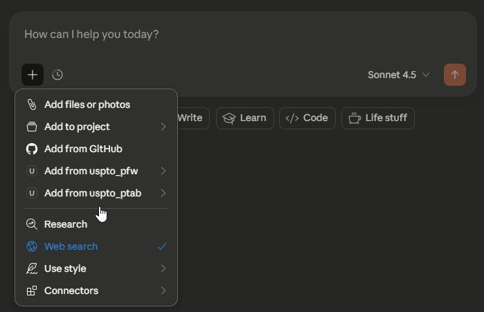
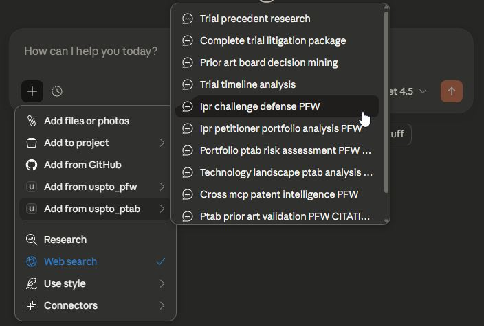
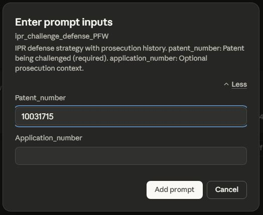
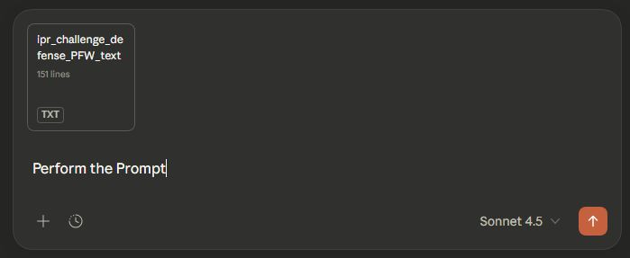

# USPTO PTAB MCP - Prompt Templates

This document details the sophisticated prompt templates included with the USPTO PTAB MCP Server for complex patent trial and appeal workflows.

## Quick Start: Prompt Templates (Attorney-Friendly Workflows)

**NEW FEATURE**: The PTAB MCP includes 11 prompt templates that appear in Claude Desktop UI. These templates automate complex multi-step workflows and eliminate the need to memorize tool syntax.

**Opt-in (server-side)**: Prompt registration is gated by the `PTAB_ENABLE_PROMPTS` environment variable (default off). Start the server with `PTAB_ENABLE_PROMPTS=true` to register all 11 prompts; when unset or false, no prompts are registered and none appear in the client UI.

### How to Use Prompt Templates

1. **In Claude Desktop**: Press the `+` button

   

2. **Select "Add from uspto_ptab"** from the dropdown menu

   

3. **Select the desired Prompt** from the dropdown menu. Note some prompts require the installation of the developer's other USPTO or Pinecone MCP servers - those requirements are denoted in the title of the Prompt (e.g., "IPR Challenge Defense PFW" requires both PTAB and PFW MCPs)

   

4. **Fill in the parameters** (trial numbers, party names, technology areas, etc.). Read the guidance for which fields are required and format of some fields

   

5. **Execute** - Claude will automatically run the complete workflow

   

---

## Overview

The MCP server includes AI-optimized prompt templates designed for patent attorneys and IP professionals. These templates provide structured workflows for common PTAB research, litigation, and strategic analysis tasks, featuring flexible input processing, cross-MCP integration, and context-efficient guidance.

---

## Standalone PTAB Templates

### 1. `/trial_precedent_research` - Find Similar PTAB Precedents

**Purpose**: Intelligent precedent discovery for PTAB strategy development

**Required Parameters**:
- `tech_area`: Technology area or classification (e.g., '2600' for communications)

**Optional Parameters**:
- `party_name`: Filter by party name (petitioner or patent owner)
- `filing_year_from`: Start year (YYYY)
- `filing_year_to`: End year (YYYY)

**Key Features**:
- Multi-tier search strategy (minimal discovery, balanced analysis)
- Outcome pattern analysis (institution rates, decision statistics)
- Strategic intelligence aggregation
- Automated precedent ranking

**Use Cases**:
- "Find similar IPR trials for semiconductor patents"
- "Analyze institution rates for wireless communications IPRs"
- "Review PTAB outcomes for Apple Inc. challenges"
- "Identify successful defense strategies in biotech patents"

**Workflow Steps**:
1. Search for similar trials (minimal tier, 50 results)
2. Analyze trial outcomes and statistics
3. Get detailed analysis of top 5-10 key trials
4. Generate strategic intelligence summary

**Example**:
```
tech_area='2600'
party_name='Apple Inc'
filing_year_from='2022'
filing_year_to='2024'
```

---

### 2. `/complete_trial_litigation_package` - Download Complete Trial Docket

**Purpose**: Retrieve complete PTAB trial documentation for litigation preparation

**Required Parameters**:
- `trial_number`: PTAB trial number (e.g., 'IPR2024-01353')

**Key Features**:
- Complete document package retrieval
- Intelligent document prioritization
- Organized chronological timeline
- Secure browser-accessible download URLs

**Use Cases**:
- "Get all documents for IPR2024-01353"
- "Download complete trial package for litigation review"
- "Retrieve Final Written Decision and all briefing"
- "Compile complete discovery package for due diligence"

**Workflow Steps**:
1. Retrieve trial details (balanced tier)
2. Get complete document list
3. Prioritize key documents (FWD, Institution Decision, Petitions, Responses)
4. Generate download URLs for browser access
5. Create organized document summary

**Document Types Retrieved**:
- Final Written Decisions
- Institution Decisions
- Petitions
- Patent Owner Responses
- Reply Briefs
- Oral Hearing Transcripts
- Exhibits

---

### 3. `/prior_art_board_decision_mining` - Extract Prior Art from Board Decisions

**Purpose**: Mine PTAB decisions for prior art references and claim construction

**Required Parameters**:
- `tech_area`: Technology area or classification

**Optional Parameters**:
- `filing_year_from`: Start year (YYYY)
- `filing_year_to`: End year (YYYY)

**Key Features**:
- Systematic prior art extraction from Final Written Decisions
- Claim construction pattern analysis
- Reference effectiveness tracking
- Technology-specific prior art database creation

**Use Cases**:
- "Find prior art used in successful IPR challenges for AI patents"
- "Extract claim construction guidance from PTAB decisions"
- "Build prior art database for defense strategy"
- "Identify effective reference combinations"

**Workflow Steps**:
1. Search for trials in technology area
2. Filter for trials with Final Written Decisions
3. Download and analyze decision documents
4. Extract prior art references and claim constructions
5. Categorize by effectiveness and outcome

---

### 4. `/trial_timeline_analysis` - Timeline Analysis of Proceeding Milestones

**Purpose**: Analyze PTAB proceeding timelines and milestone patterns

**Required Parameters**:
- `trial_number`: PTAB trial number (e.g., 'IPR2024-01353')

**Key Features**:
- Complete timeline reconstruction
- Milestone tracking and analysis
- Procedural pattern identification
- Duration analysis for strategic planning

**Use Cases**:
- "Create timeline for IPR2024-01353"
- "Analyze procedural patterns for trial planning"
- "Track milestone deadlines and extensions"
- "Compare trial duration to typical proceedings"

**Workflow Steps**:
1. Retrieve trial metadata (balanced tier)
2. Get document list with filing dates
3. Construct chronological timeline
4. Identify key milestones
5. Calculate durations between milestones
6. Generate visual timeline summary

---

## Cross-MCP Integration Templates (PFW)

### 5. `/ipr_challenge_defense_PFW` - IPR Defense Strategy with Prosecution History

**Purpose**: Comprehensive IPR defense preparation combining PTAB and prosecution history

**Required Parameters**:
- `trial_number`: PTAB trial number (e.g., 'IPR2024-01353')

**Integration**: Requires USPTO PFW MCP

**Key Features**:
- Links IPR challenge to prosecution history
- Identifies examiner-considered prior art
- Analyzes prosecution file wrapper arguments
- Builds comprehensive defense strategy

**Use Cases**:
- "Prepare IPR defense for trial IPR2024-01353"
- "Cross-reference IPR challenge with prosecution history"
- "Identify examiner's prior art consideration"
- "Build § 301-303 secondary consideration arguments"

**Workflow Steps**:
1. Retrieve IPR trial details (PTAB MCP)
2. Identify patent number and challenged claims
3. Get prosecution file wrapper (PFW MCP)
4. Compare IPR prior art with examiner citations
5. Extract prosecution arguments for defense
6. Generate strategic defense recommendations

---

### 6. `/ipr_petitioner_portfolio_analysis_PFW` - Portfolio IPR Risk Assessment

**Purpose**: Analyze entire patent portfolio for IPR vulnerability

**Required Parameters**:
- `patent_owner_name`: Patent owner name for portfolio search

**Optional Parameters**:
- `tech_center`: Limit to specific art unit/technology center

**Integration**: Requires USPTO PFW MCP

**Key Features**:
- Portfolio-wide PTAB challenge tracking
- Prosecution quality correlation
- Art unit risk analysis
- Predictive risk scoring

**Use Cases**:
- "Assess Apple Inc. portfolio for PTAB risk"
- "Identify vulnerable patents in portfolio"
- "Analyze prosecution patterns affecting IPR risk"
- "Generate portfolio defense strategy"

**Workflow Steps**:
1. Search patent owner's portfolio (PFW MCP)
2. Search for PTAB challenges on portfolio patents (PTAB MCP)
3. Correlate prosecution history with IPR outcomes
4. Identify risk factors (claim construction, prior art, art unit patterns)
5. Generate portfolio risk report

---

### 7. `/technology_landscape_ptab_analysis_PFW` - Technology Area PTAB Trends

**Purpose**: Comprehensive technology landscape analysis combining PTAB challenges and prosecution patterns

**Required Parameters**:
- `tech_area`: Technology area or art unit (e.g., '2600')

**Optional Parameters**:
- `filing_year_from`: Start year (YYYY)
- `filing_year_to`: End year (YYYY)

**Integration**: Requires USPTO PFW MCP

**Key Features**:
- Technology-specific PTAB challenge patterns
- Prosecution quality trends
- Examiner behavior correlation
- Competitive intelligence

**Use Cases**:
- "Analyze PTAB landscape for AI technology"
- "Track institution rates by art unit"
- "Compare prosecution vs. PTAB patterns"
- "Identify high-risk technology areas"

**Workflow Steps**:
1. Search PTAB proceedings by technology area (PTAB MCP)
2. Analyze institution rates and outcomes
3. Search prosecution filings in same technology (PFW MCP)
4. Correlate prosecution patterns with IPR risk
5. Generate technology landscape report

---

### 8. `/cross_mcp_patent_intelligence_PFW` - Complete Patent Intelligence Package

**Purpose**: Comprehensive patent analysis combining prosecution, PTAB, and strategic intelligence

**Required Parameters**:
- `patent_number`: Patent number for analysis

**Integration**: Requires USPTO PFW MCP

**Key Features**:
- Complete patent lifecycle analysis
- Prosecution history review
- PTAB challenge assessment
- Strategic intelligence synthesis

**Use Cases**:
- "Complete intelligence package for patent 10701173"
- "Due diligence analysis for patent acquisition"
- "Litigation preparation package"
- "Portfolio valuation assessment"

**Workflow Steps**:
1. Get patent prosecution history (PFW MCP)
2. Search for PTAB proceedings on patent (PTAB MCP)
3. Analyze prosecution quality and strategies
4. Assess PTAB challenge history and outcomes
5. Generate comprehensive intelligence report

---

## Cross-MCP Integration Templates (PFW + FPD)

### 9. `/portfolio_ptab_risk_assessment_PFW_FPD` - Combined Prosecution and PTAB Risk

**Purpose**: Advanced portfolio risk assessment incorporating prosecution procedural issues

**Required Parameters**:
- `patent_owner_name`: Patent owner name for portfolio search

**Integration**: Requires USPTO PFW MCP and USPTO FPD MCP

**Key Features**:
- Portfolio-wide PTAB risk analysis
- Prosecution procedural red flag identification
- Examiner behavior pattern correlation
- Comprehensive risk scoring

**Use Cases**:
- "Complete portfolio risk analysis for Company XYZ"
- "Identify prosecution weaknesses affecting PTAB vulnerability"
- "Analyze petition patterns correlated with IPR institution"
- "Generate comprehensive portfolio defense strategy"

**Workflow Steps**:
1. Search patent owner's portfolio (PFW MCP)
2. Search for PTAB challenges (PTAB MCP)
3. Search for petition history (FPD MCP)
4. Correlate prosecution issues with PTAB outcomes
5. Identify procedural red flags and risk factors
6. Generate multi-factor risk assessment

---

## Cross-MCP Integration Templates (PFW + Citations)

### 10. `/ptab_prior_art_validation_PFW_CITATIONS` - Validate Prior Art Across MCPs

**Purpose**: Cross-validate prior art references using PTAB decisions, prosecution citations, and examiner effectiveness data

**Required Parameters**:
- `patent_number`: Patent number for analysis

**Integration**: Requires USPTO PFW MCP and USPTO Enriched Citation MCP

**Key Features**:
- Prior art validation across data sources
- Examiner citation effectiveness analysis
- PTAB Board preferred references identification
- Strategic prior art selection guidance

**Use Cases**:
- "Validate prior art for patent 10701173"
- "Identify most effective prior art references"
- "Compare examiner citations with PTAB usage"
- "Build optimal prior art combination"

**Workflow Steps**:
1. Get prosecution file wrapper (PFW MCP)
2. Extract examiner citations and effectiveness (Citations MCP)
3. Search PTAB proceedings on patent (PTAB MCP)
4. Compare prior art usage across sources
5. Rank references by effectiveness and Board acceptance
6. Generate strategic prior art recommendations

---

## Cross-MCP Integration Templates (PFW + FPD + Citations)

### 11. `/complete_prosecution_lifecycle_PFW_FPD_CITATIONS` - Full Lifecycle Tracking

**Purpose**: Complete patent lifecycle analysis from filing through PTAB challenges

**Required Parameters**:
- `application_number` OR `patent_number`: Application or patent number for analysis

**Integration**: Requires USPTO PFW MCP, USPTO FPD MCP, and USPTO Enriched Citation MCP

**Key Features**:
- Complete lifecycle timeline
- Multi-source data integration
- Comprehensive risk assessment
- Strategic intelligence synthesis

**Use Cases**:
- "Complete lifecycle analysis for application 16/682,059"
- "Track patent from filing through PTAB challenge"
- "Comprehensive due diligence package"
- "Multi-year strategic patent analysis"

**Workflow Steps**:
1. Get complete prosecution history (PFW MCP)
2. Retrieve citation analysis (Citations MCP)
3. Check for petition proceedings (FPD MCP)
4. Search for PTAB challenges (PTAB MCP)
5. Construct comprehensive timeline
6. Analyze quality factors and risk indicators
7. Generate complete lifecycle intelligence report

---

## Template Features

### Common Features Across All Templates

1. **Progressive Disclosure**: Start with minimal tier searches for efficiency
2. **Error Handling**: Robust error handling for cross-MCP calls
3. **Context Optimization**: Token-efficient data processing
4. **Flexible Input**: Automatic validation and guidance
5. **Professional Outputs**: Attorney-ready summaries and reports

### Cross-MCP Integration Patterns

- **PFW Integration**: Prosecution history and file wrapper access
- **FPD Integration**: Petition and procedural issue tracking
- **Citations Integration**: Prior art effectiveness and examiner behavior
- **Multi-MCP Workflows**: Complete lifecycle tracking across all data sources

### Safety Rails and Best Practices

1. **Context Limits**: Explicit warnings for large data retrievals
2. **Incremental Processing**: Step-by-step workflows to prevent token overflow
3. **Result Aggregation**: Systematic data collection and scoring
4. **Presentation Formatting**: Markdown tables and structured outputs
5. **Cross-Tool Coordination**: Intelligent tool selection and sequencing

---

## Technical Details

### Parameter Validation

All templates include:
- Required parameter checking with clear error messages
- Optional parameter handling with sensible defaults
- Input format validation with examples
- Flexible date range support

### Output Format

Templates generate:
- Markdown-formatted reports with tables
- Organized hierarchical sections
- Visual timelines and statistics
- Downloadable document packages
- Strategic recommendations

### Performance Optimization

- Minimal tier discovery for initial searches (95-99% context reduction)
- Balanced tier analysis for detailed review (85-95% context reduction)
- Selective document retrieval to minimize token usage
- Efficient cross-MCP data coordination

---

## Example Workflow: Complete IPR Defense

```
1. User fills prompt: /ipr_challenge_defense_PFW
   trial_number='IPR2024-01353'

2. Claude executes workflow:
   - Retrieves IPR trial details (PTAB)
   - Identifies patent number and claims
   - Gets prosecution history (PFW)
   - Compares prior art references
   - Extracts defense arguments

3. User receives:
   - Complete IPR challenge analysis
   - Prosecution file wrapper comparison
   - Defense strategy recommendations
   - Document download links
   - Strategic intelligence summary
```

---

## Next Steps

After using prompt templates:

1. **Review Results**: Claude presents structured analysis
2. **Download Documents**: Use provided URLs for PDF access
3. **Refine Search**: Adjust parameters and re-run if needed
4. **Cross-Reference**: Combine multiple prompts for comprehensive analysis
5. **Export Intelligence**: Save reports for litigation or due diligence

For detailed function documentation, see **[USAGE_EXAMPLES.md](USAGE_EXAMPLES.md)**

For installation and setup, see **[INSTALL.md](INSTALL.md)**

---

**Last Updated**: 2026-01-11
**Version**: 1.0.0
**Status**: Production Ready ✅
**Templates**: 11 total (4 standalone + 7 cross-MCP integration)
